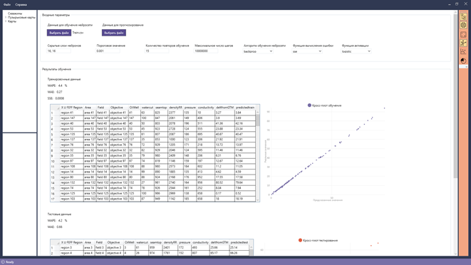
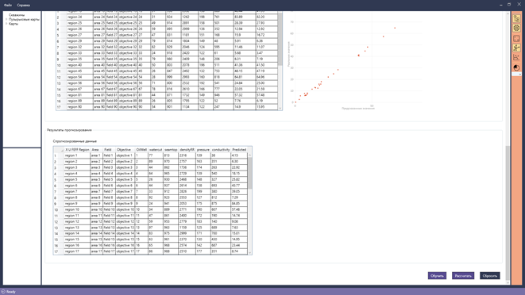
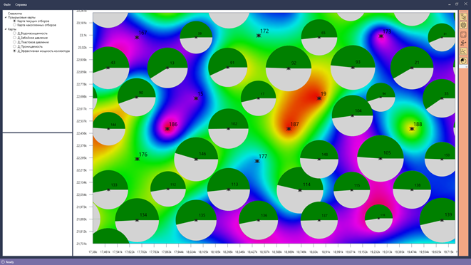
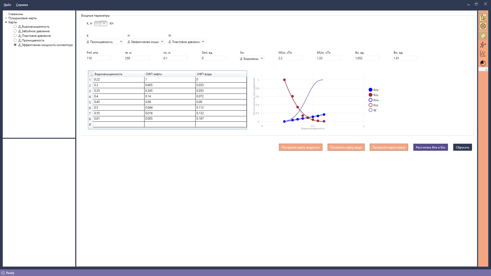

# NNDP
An analytical system for prediction of stimulation from well treatments using Machine Learning.

The software product allows you to import information about wells, maps of geological and field parameters and interract with them. Implemented interpolation kriging for building maps from user data. The main purpose of the program is to predict the increase in oil production rate for wells and build a map based on the predicted values.
The program is written on the WPF platform. The R language was used for interpolation kriging and neural network.

Increase in oil production rate calculatioin methods:
1. Neural network
2. Dupuit–Thiem equation

**NeuralNet**

Neuralnet part of the project was written with help of R package: neuralnet. It was enchanced to change amount of neurons on the input layer depending on the input file.

User can change the following parameters of NN:
1. Structure of hidden layers in the NN
2. Threshold for the partial derivatives
3. Repetitions for the neural network’s training
4. Maximum steps for the training
5. Algorithm type to calculate the neural network
6. Error function
7. Activation function

NN part of the program: 

*Training/Testing results:*

*Prediction results:*

Information about wells and maps of geological parameters:

Dupuit–Thiem equation part of the program:
