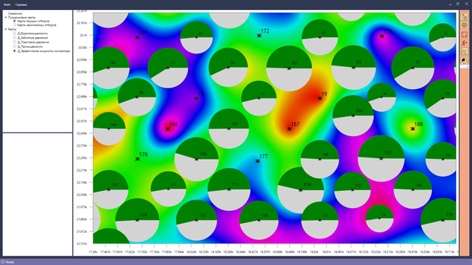
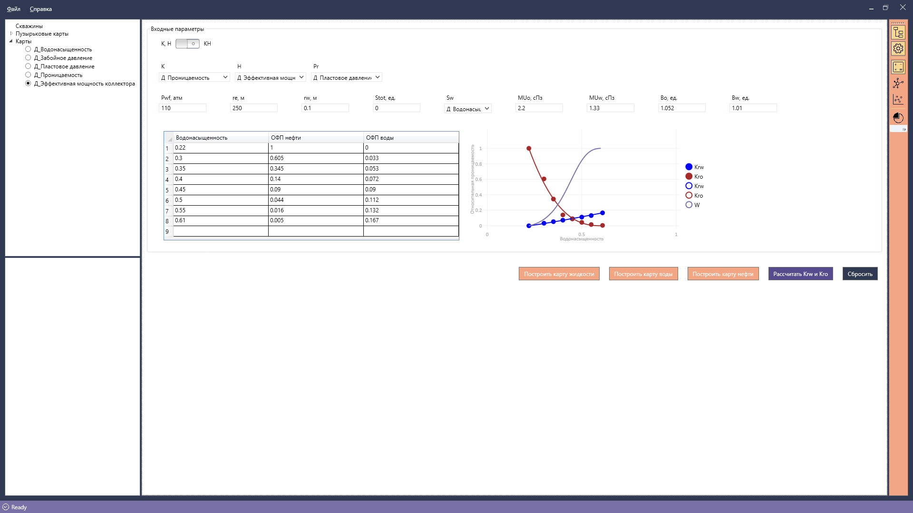

# NNDP
Аналитическая система для прогнозирования эффекта от гоеолого-технических мероприятий с использованием нейронных сетей.
 
Программный продукт позволяет импортировать информацию о скважинах, карты геолого-промысловых параметров, а также отображать данные объекты и взаимодействовать с ними.
Реализован интерполяционный кригинг для построения карт по пользовательским данным. Есть возможность экспорта сетки значений по скважинам с карт.
Основным назначением программы является прогнозирование прироста дебита нефти для скважин и построение карты по предсказанным значениям.

Потенциальный дебит рассчитвается различными способами:
1. При помощи нейронной сети (Многослойный персептрон Румельхарта)
2. По формуле дюпюи

**Нейронная сеть**

Нейронная сеть написана на языке программирования R с использованием пакета neuralnet. 
Количество входных нейронов автоматически меняется в зависимости от количества входных параметров.
В программе предусмотрена настройка следующих параметров НС:
1. Количество скрытых слоев и нейронов на каждом скрытом слое
2. Пороговое значение активации нейронов
3. Количество повторов обучения
4. Максимальное число шагов
5. Алгоритм обучения нейронной сети
6. Функция вычисления обшибки
7. Функция активации

Пример работы нейронной сети: 

*Результаты тестирования:*

*Результаты прогнозирования:*

Отображение инормации о скважинах и карт геолого-промысловых параметров:

Область построения карт потенциальных дебитов по формуле дюпюи:
